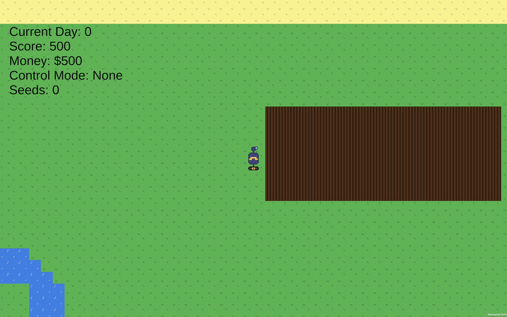
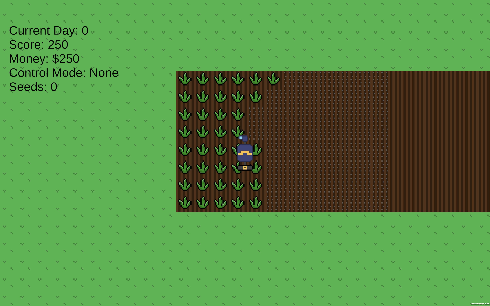

# Fantastic Farming
A 2D, pixel art, tycoon game that encourages ethical decision-making through its use of in-game items with varying effects on a player’s farm.

# Playing
## Controls
- W/A/S/D or Arrow Keys: To move
- F: Toggle Farm Mode
  - 1: Select Plow Mode
  - 2: Select Plant Mode
  - 3: Select Harvest Mode
- Q: Toggle Store
- Escape: Quit
- Tab: Toggle Inventory

## Color Blind Mode
Fantastic Farming features a color blind mode to aid users with popular variants of color blindness.
- Protanopia (red / green colorblindness)
- Deuteranopia (red / green colorblindness)
- Tritanopia (blue / yellow colorblindness)

### Colorblind Mode
Changes the color of some in-game elements to maintain proper contrast.

### Colorblind Filter
Simulates different types of colorblindness to help developer maintain proper contrast between game elements.

## Objective
The goal of the game, like any tycoon game, is to maximize your score and money.
The basic game loop is: Buy seeds -> plant -> harvest -> repeat

## In-Game Items
### Seeds
Seeds can be planted on farmland. By pressing F, then 2.
### Pesticide
Pesticide doubles your crop yield at the cost of an extra 20% chance of being randomly penalized after each day. 

# Screenshots

# Building
1. [Install Unity 6000.0.32f1](https://unity.com/download)
2. Open the project with Unity
3. Open build settings: Window->Panels->Build Settings
4. Select the target platform and press build

